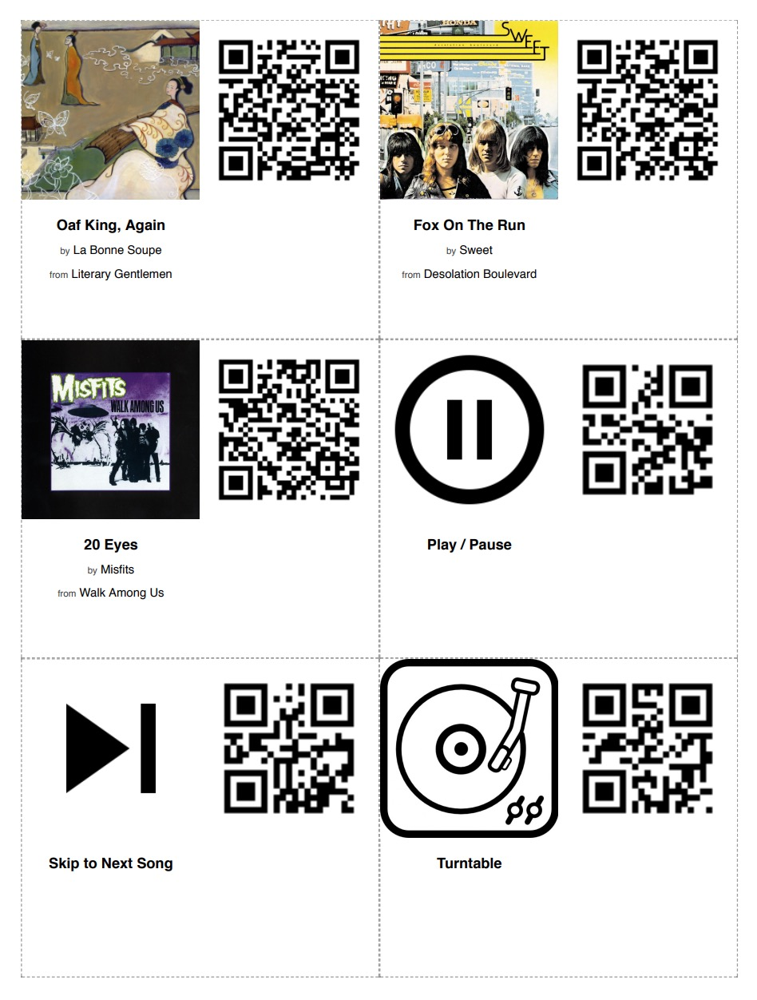

# qrocodile

A kid-friendly system for controlling Sonos with QR codes.

## What Is It?

On the hardware side, it's just a camera-attached Raspberry Pi nested inside some green LEGO and running some custom software that scans QR codes and translates them into commands that control your Sonos system.

On the software side, there are two separate Python scripts:

* Run `qrgen.py` on your primary computer.  It takes a list of songs (from your local music library and/or Spotify) and commands (e.g. play/pause, next) and spits out an HTML page containing little cards imprinted with an icon and text on one side, and a QR code on the other.  Print them out, then cut, fold, and glue until you're left with a neat little stack of cards.

* Run `qrplay.py` on your Raspberry Pi.  It launches a process that uses the attached camera to scan for QR codes, then translates those codes into commands (e.g. "speak this phrase", "play [song] in this room", "build a queue").

## Installation and Setup

### 1. Prepare your Raspberry Pi

I built this using a Raspberry Pi 3 Model B (running Raspbian) and an Arducam OV5647 camera module.  Things may or may not work with other models (for example, how you control the onboard LEDs varies by model).

To set up the camera module, I had to add an entry in `/etc/modules`:

```
% sudo emacs /etc/modules
# Add bcm2835-v4l2
% sudo reboot
# After reboot, verify that camera is present
% ls -l /dev/video0
```

Next, install `zbar-tools` (used to scan for QR codes) and test it out:

```
% sudo apt-get install zbar-tools
% zbarcam --prescale=300x200
```

Optional: Make a little case to hold your RPi and camera along with a little slot to hold a card in place.

### 2. Start `node-sonos-http-api`

Currently `qrplay` relies on a [custom fork](https://github.com/chrispcampbell/node-sonos-http-api/tree/qrocodile) of `node-sonos-http-api` that has been modified to do things like:

* look up library tracks using only a hash string (to keep the QR codes simple)
* return a list of all available library tracks and their associated hashes
* speak the current/next track
* play the album associated with a song
* other things I'm forgetting at the moment

(Note: `node-sonos-http-api` made it easy to bootstrap this project, as it already did much of what I needed.  However, it would probably make more sense to use something like [SoCo](https://github.com/SoCo/SoCo) (a Sonos controller API for Python) so that we don't need to run a separate server, and `qrplay` could control the Sonos system directly.)

It's possible to run `node-sonos-http-api` directly on the Raspberry Pi, so that you don't need an extra machine running, but I found that it's kind of slow this way (especially when the QR scanner process is already taxing the CPU), so I usually have it running on a separate machine to keep things snappy.

To install, clone my fork, check out the `qrocodile` branch, install, and start:

```
% git clone -b qrocodile https://github.com/chrispcampbell/node-sonos-http-api.git
% cd node-sonos-http-api
% npm install --production
% npm start
```

### 3. Generate some cards with `qrgen`

First, clone the `qrocodile` repo if you haven't already on your primary computer:

```
% git clone https://github.com/chrispcampbell/qrocodile
% cd qrocodile
```

Also install `qrencode` via Homebrew:

```
% brew install qrencode
```

Spotify track URIs can be found in the Spotify app by clicking a song, then selecting "Share > Copy Spotify URI".  For `qrgen` to access your Spotify account, you'll need to set up your own Spotify app token.  (More on that in the `spotipy` [documentation](http://spotipy.readthedocs.io/en/latest/).)

You can use `qrgen` to list out URIs for all available tracks in your music library (these examples assume `node-sonos-http-api` is running on `localhost`):

```
% python qrgen.py --hostname localhost --list-library
```

Next, create a text file that lists the different cards you want to create.  (See `example.txt` for some possibilities.)

Finally, generate some cards and view the output in your browser:

```
% python qrgen.py --hostname localhost --input example.txt
% open out/index.html
```

It'll look something like this:



### 4. Start `qrplay`

On your Raspberry Pi, clone this `qrocodile` repo:

```
% git clone https://github.com/chrispcampbell/qrocodile
% cd qrocodile
```

Then, launch `qrplay`, specifying the hostname of the machine running `node-sonos-http-api`:

```
% python qrplay.py --hostname 10.0.1.6
```

If you want to use your own `qrocodile` as a standalone thing (not attached to a monitor, etc), you'll want to set up your RPi to launch `qrplay` when the device boots:

```
% emacs ~/.config/lxsession/LXDE-pi/autostart
# Add an entry to launch `qrplay.py`, pipe the output to a log file, etc
```

## The Cards

Currently `qrgen` and `qrplay` have built-in support for two different kinds of cards: song cards, and command cards.

Song cards can be generated for tracks in your music library or from Spotify, and can be used to play just that song, add that song to the queue, or play the entire album.  For example:


Command cards are used to control your Sonos system, performing actions like switching to a different room, activating the line-in input on a certain device, or pausing/playing the active device.  Here are the commands that are currently supported:

 

 

 

 

 

## The Backstory

It all started one night at the dinner table.  The kids wanted to put an album on the turntable (hooked up to the line-in on a Sonos PLAY:5 in the dining room).  They're perfectly capable of putting vinyl on the turntable all by themselves, but using the Sonos app to switch over to play from the line-in is a different story.

I was lamenting aloud the number of steps it takes and then I started pondering solutions.  Take off my tin foil hat and give in to the Alexa craze?  Buy some sort of IoT button thing?  An RFID tag thing?  QR codes maybe?  The latter option got me thinking of all kinds of possibilities.  Maybe the kids could choose dinner music from any number of songs/albums (from Spotify or my local collection) just by waving a QR code in front of something.  Or maybe now they could build their own dance party playlists.

It seemed like a fun thing to explore, so I ordered a Raspberry Pi and a cheap camera.  The next day it arrived and the hacking began.

## Acknowledgments

This was a fun little project to put together mainly because other folks already did much of the hard work.

Hearty thanks to the authors of the following libraries:

* [qrencode](https://github.com/fukuchi/libqrencode)
* [node-sonos-http-api](https://github.com/jishi/node-sonos-http-api)
* [spotipy](https://github.com/plamere/spotipy)
* [webkit2png](https://github.com/paulhammond/webkit2png)

Thanks also to my kids and wife for all the help with building, printing, cutting, folding, gluing, testing, and filming.

## License

`qrocodile` is released under an MIT license. See the LICENSE file for the full license.
