# qrocodile

A kid-friendly system for controlling Sonos with QR codes.

## Origin

This is a fork of the *qrocodile* project originally developed by https://github.com/chrispcampbell

Changes to the original:
* support for Spotify **Albums** & **Playlists** & **Artists** (using the Sonos Queue)
* generation of cards for the Sonos Zones (Rooms) available on your network
* reliance on a my_defaults.txt file containing custom defaults for Sonos Room, Spotify User and node-sonos host
* Using a python module instead of an OS package for the generation of QR codes
* replaced urllib with **requests** python module
* updated to python 3.x
* disabled use of webkit2png
* added variables for default announcement volume and language
* separated card creation files between: Commands, Music (albums, artists, playlists) and Sonos Rooms
* added shuffle on/off and repeat on/off commands

For the whole story behind qrocodile, see the original project https://github.com/chrispcampbell/qrocodile

## What Is It?

On the hardware side, it's just a camera-attached Raspberry Pi nested inside some LEGO and running some custom software that scans QR codes and translates them into commands that control your Sonos system:

<p align="center">
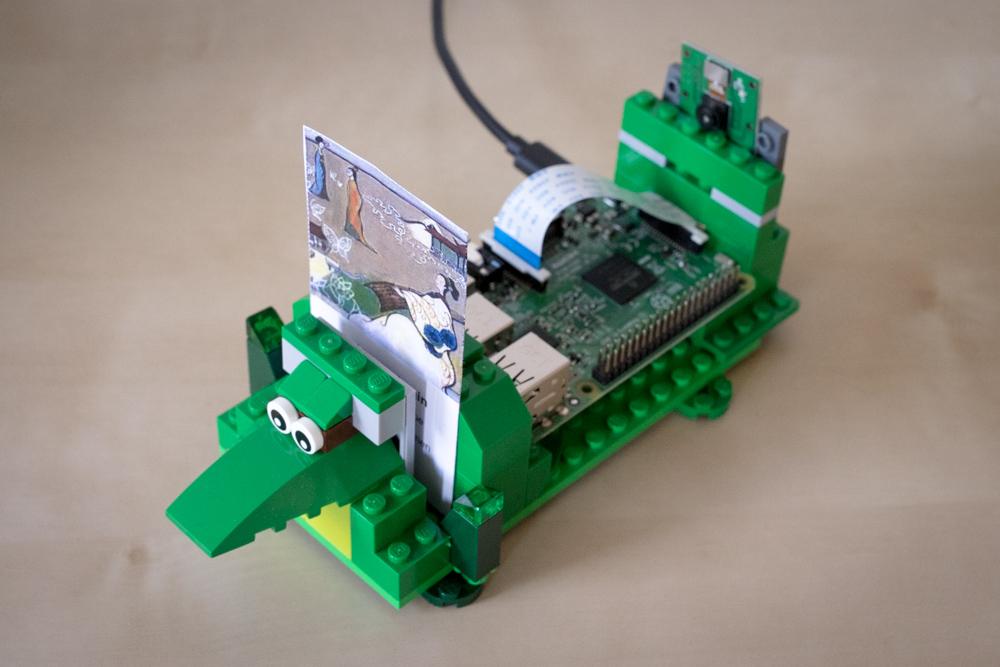 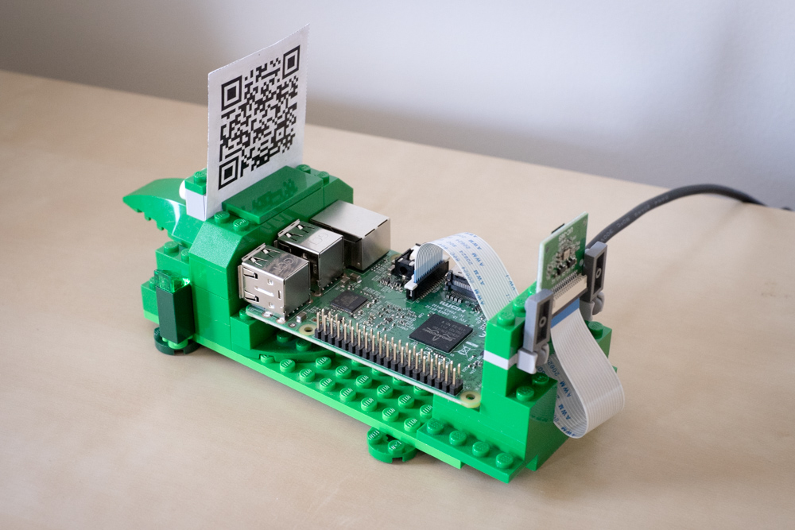
</p>

On the software side, there are two separate Python scripts:

* Run `qrgen.py` on any computer. It takes a list of songs (from your local music library and/or Spotify), commands (e.g. play/pause, next) or sonos zones and spits out an HTML page containing little cards imprinted with an icon and text on one side, and a QR code on the other. Print them out, then cut, fold, and glue until you're left with a neat little stack of cards.

* Run `qrplay.py` on your Raspberry Pi. It launches a process that uses the attached camera to scan for QR codes, then translates those codes into commands (e.g. "speak this phrase", "play [song|artist|album|playlist] in this room", "build a queue").

Requirements:

* Spotify developer account (in order to play content from spotify)
* Python 3
* Python modules:
  * spotipy
  * requests
  * pyqrcode
  * pypng


## Spotify Account

Both for generating cards and for playing content, you will need:
* Spotify Premium account
* [Spotify Developer account](https://developer.spotify.com/my-applications/#!/applications/create) (free) and create an application

## Installation and Setup

### 1. node-sonos-http-api

This node service allows to interact with the available sonos speakers via an API.

To install, clone the [custom fork](https://github.com/chrispcampbell/node-sonos-http-api/tree/qrocodile), check out the `qrocodile` branch, install, and start:

```
% git clone -b qrocodile https://github.com/chrispcampbell/node-sonos-http-api.git
% cd node-sonos-http-api
% npm install --production
% npm start
```

On Debian, the **nodejs-legacy** package was required as well as the standard **nodejs** package. 
The node server will start listening on port :5005 of the computer it is running on.

In order 
For the announcements, it uses Google TTS, see [node-sonos-http-api](https://github.com/chrispcampbell/node-sonos-http-api/tree/qrocodile) for all the details.

### 2. Prepare your Raspberry Pi to read qrcodes with qrplay.py

The control of the LEDs will differ based on the Raspberry Pi in use. In my setup, I am using a RPi 3 Model B to run both node and qrplay (although a bit slower, qrplay.py also worked well on a Raspberry Pi Zero W) and an Arducam OV5647 camera module. 

To set up the camera module, I had to:

* connect the camera to the slot on the RPi
* enable the camera via **raspi-config**
* add an entry in `/etc/modules`:

```
% sudo emacs /etc/modules
# Add bcm2835-v4l2
% sudo reboot
# After reboot, verify that camera is present
% ls -l /dev/video0
```

Next, install `zbar-tools` (used to scan for QR codes) and test it out:

```
% sudo apt-get install zbar-tools
% zbarcam --prescale=300x200
```

Optional: Make a little case to hold your RPi and camera along with a little slot to hold a card in place.

### 3. Generate some cards with `qrgen`

First, clone the `qrocodile` repo if you haven't already on your primary computer:

```
% git clone https://github.com/dernorberto/qrocodile
% cd qrocodile
```

#### 3.1 create music cards

Create a text file that lists the different music cards you want to create.  (See `example.txt` for some possibilities.)

Spotify track/album/playlist URIs can be found in the Spotify app by clicking a song|album|playlist, then selecting "Share > Copy Spotify URI".  For `qrgen` to access your Spotify account, you'll need to set up your own Spotify app token.  (More on that in the `spotipy` [documentation](http://spotipy.readthedocs.io/en/latest/).)

```
% python3 qrgen.py --generate-images --input=<file containing URIs>
% open out/index.html
```

Without a my_defaults.txt file, you will need to indicate `--hostname` and `--spotify-user` arguments.

```
% python3 qrgen.py --hostname <IP of node-sonos-http-api host> --input example.txt --generate-images --spotify-user <spotify username>
% open out/index.html
```

The **out** folder will contain an **index.html** with the generated content. If ran on the RPi, it can be handy to access that content via HTTP, Install nginx (or any other webserver) and edit the default vhost config, like for nginx:

```

root /home/pi/git/qrocodile/out/;

location / {
        try_files $uri $uri/ =404;
        index index.html zones.html commands.html;
        }
```

#### 3.2 generate my_defaults.txt file

You can use `qrgen` to generate a file containing your defaults, you will be asked for the Spotfy username, the IP address of the server running the node-sonos-http-api and the default Sonos room. The last used Sonos Room will override the Default.

```
% python3 qrgen.py --set-defaults
```


#### 3.3 generate Sonos Zones/Rooms cards

The cards for Commands and Sonos Zones are generated separately.

Create Sonos Zone cards using `qrgen`, it does not require a list file. Omit `--hostname` if you created a defaults file.

```
% python3 qrgen.py --zones --hostname <IP of node-sonos-http-api host>
% open out/zones.html
```

#### 3.4 generate Commands cards

Create Command cards using qrgen and the text file command_cards.txt. All available commands are in the command_cards_all.txt, place the ones you need in command_cards.txt and generate the cards.

```
% python3 qrgen.py --commands
% open out/commands.html
```


### 4. Start `qrplay`

On your Raspberry Pi, clone this `qrocodile` repo:

```
% git clone https://github.com/dernorberto/qrocodile
% cd qrocodile
```

Then, launch `qrplay`, specifying the hostname of the machine running `node-sonos-http-api`:

```
% python3 qrplay.py --hostname <IP of node-sonos-http-api host>
```

### 5. start services on boot for a stand-alone RPi

#### 5.1 qrplay using systemd

If you want to use your own `qrocodile` as a standalone thing (not attached to a monitor, etc), you'll want to set up your RPi to launch `qrplay` when the device boots. Here's a **qrplay.service** systemd unit file:

```
[Unit]
Description=qrplay
After=network.target node-sonos-http-api.service

[Service]
Type=simple
Restart=always
PIDFile=/run/qrplay.pid
#ExecStart=/home/pi/scripts/qrplay.sh
ExecStart=/usr/bin/python3 /home/pi/git/qrocodile/qrplay.py
WorkingDirectory=/home/pi/git/qrocodile/
User=pi
Environment="SPOTIPY_CLIENT_ID=<your spotify client id>" "SPOTIPY_CLIENT_SECRET=<your spotify client secret>"

[Install]
WantedBy=multi-user.target
```

then run
```
% systemctl reload-daemon
% systemctl enable qrplay.service
```

#### 5.2 node-sonos-http-api

It is possible to keep this node server running on boot and restart if it stops working using [forever](https://github.com/foreverjs/forever). Here's part of a /etc/init.d/node-sonos-http-api file that starts the node server using forever.

```
...
APPLICATION_PATH="/home/pi/git/node-sonos-http-api/server.js"
PIDFILE="/var/run/$NAME.pid"
...
    forever \
      --pidFile $PIDFILE \
      -a \
      -l $LOGFILE \
      --minUptime $MIN_UPTIME \
      --spinSleepTime $SPIN_SLEEP_TIME \
      start $APPLICATION_PATH 2>&1 > /dev/null &
...
```

#### 5.3 generate zone cards on boot

If you'd like to have fresh sonos zone cards on every boot, you can have a **zones.service** systemd unit file:

```
[Unit]
Description=qrgen zones
After=network.target qrplay.service node-sonos-http-api.service

[Service]
Type=oneshot
ExecStart=/usr/bin/python3 /home/pi/git/qrocodile/qrgen.py --zones
RemainAfterExit=false
WorkingDirectory=/home/pi/git/qrocodile/
User=pi

[Install]
WantedBy=multi-user.target
```

Then run
```
% systemctl reload-daemon
% systemctl enable zones.service
```


## The Cards

Currently `qrgen` and `qrplay` have built-in support for six different kinds of cards: song, artist, album, playlist, commands and zone cards

Song cards can be generated for tracks in your music library or from Spotify, and can be used to play just that song, add that song to the queue, or play the entire album. For example:

<p align="center">
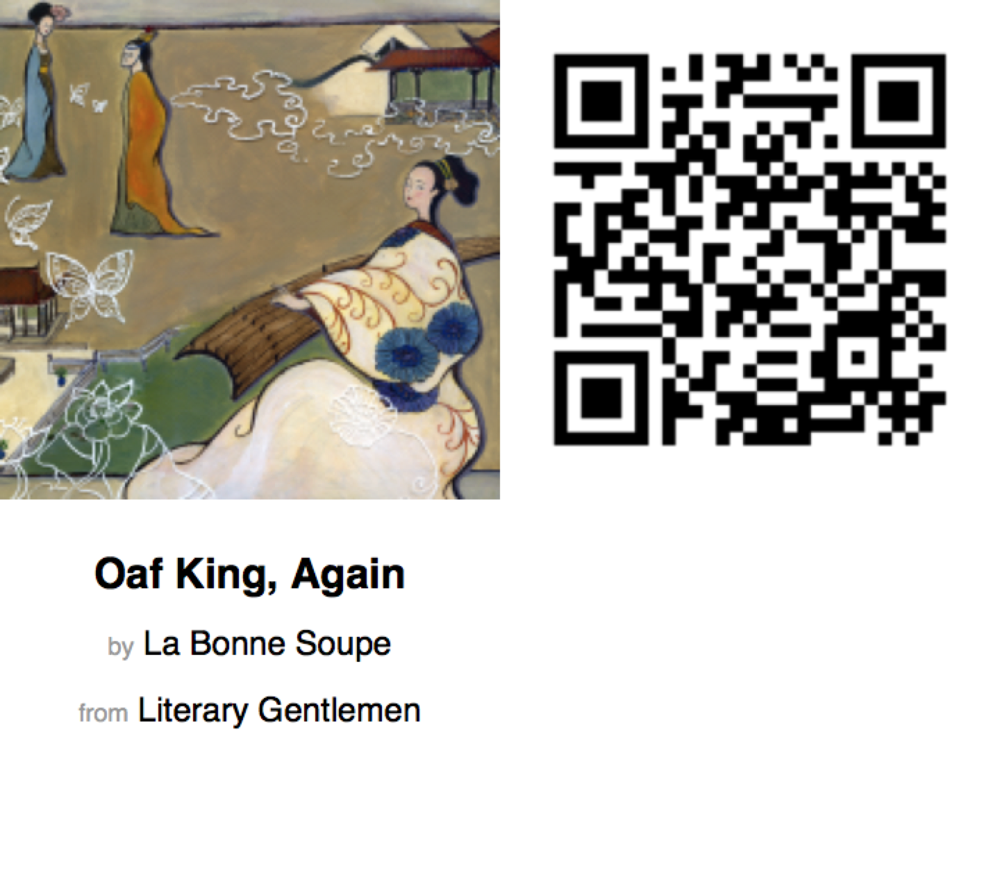
</p>

Command cards are used to control your Sonos system, performing actions like switching to a different room, activating the line-in input on a certain device, or pausing/playing the active device.  Here are the commands that are currently supported:

<p align="center">
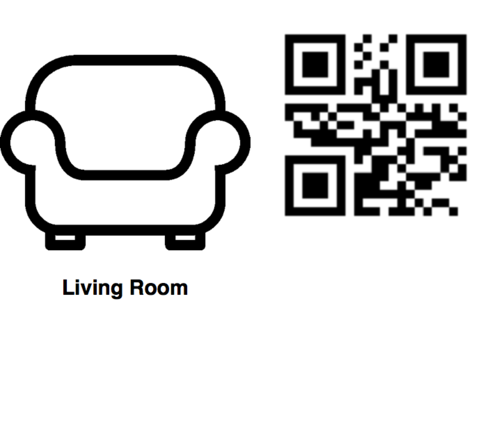 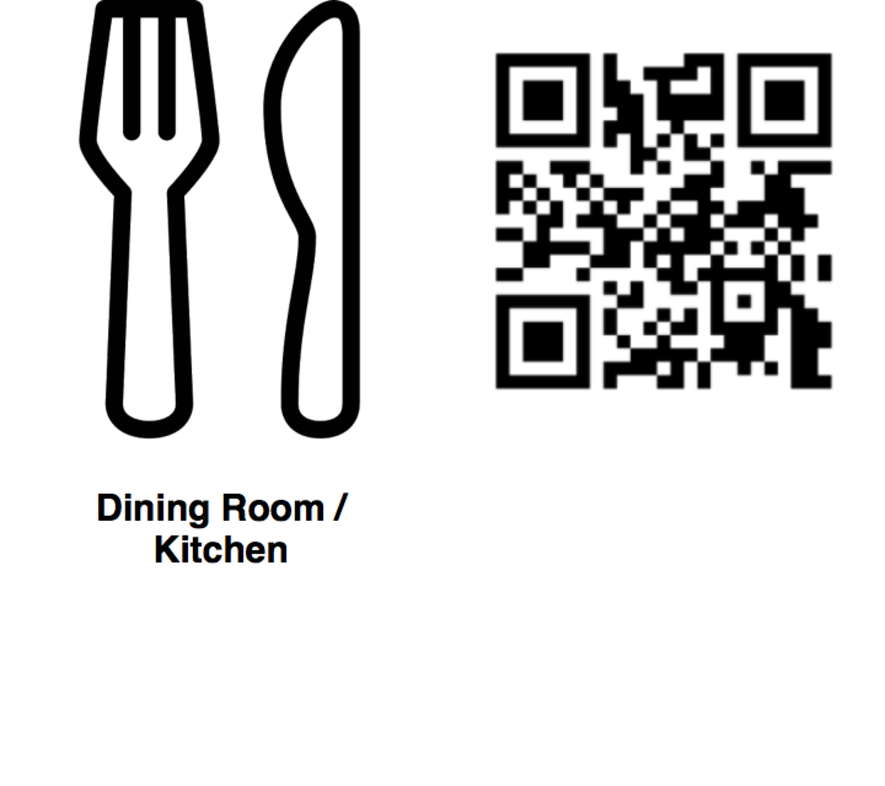
</p>

<p align="center">
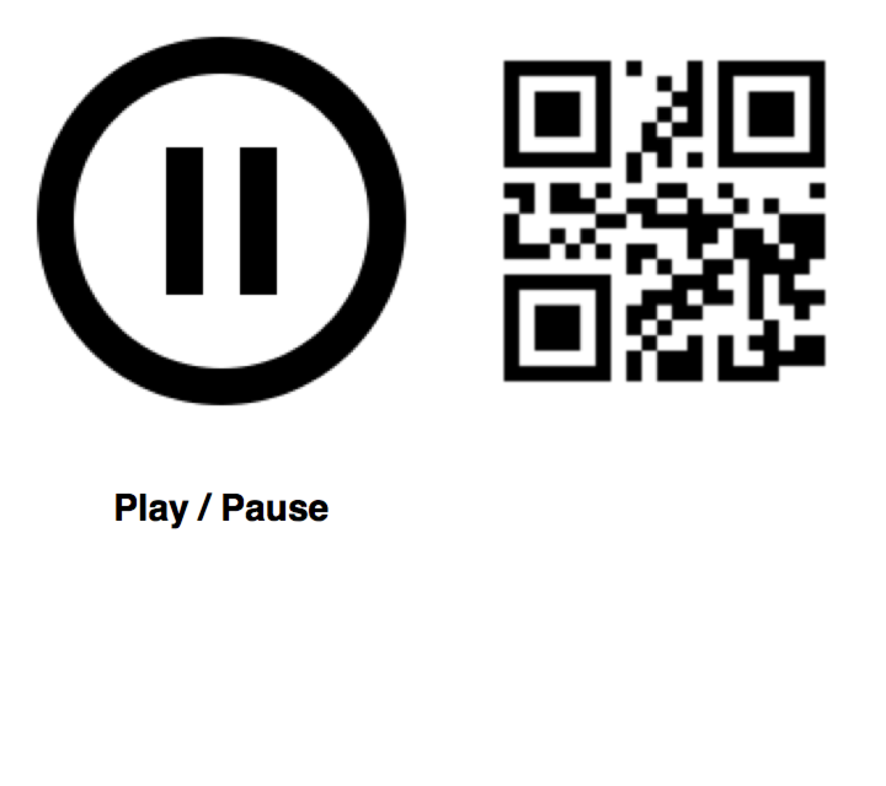 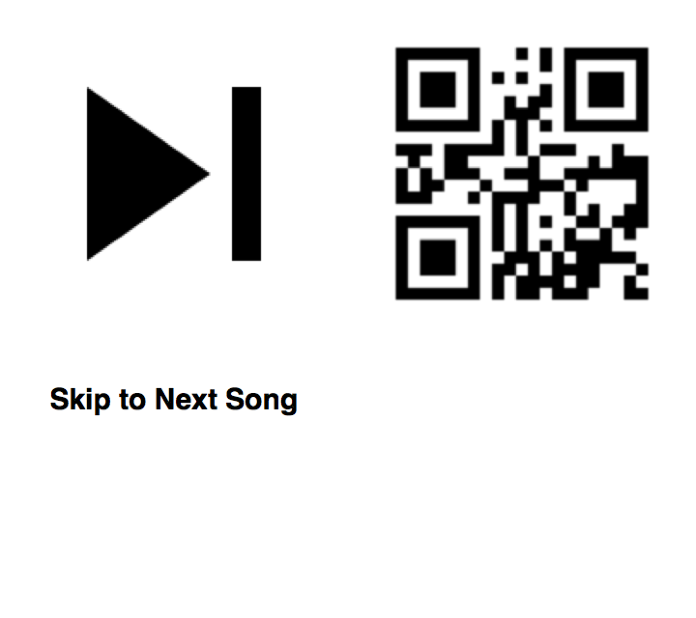
</p>

<p align="center">
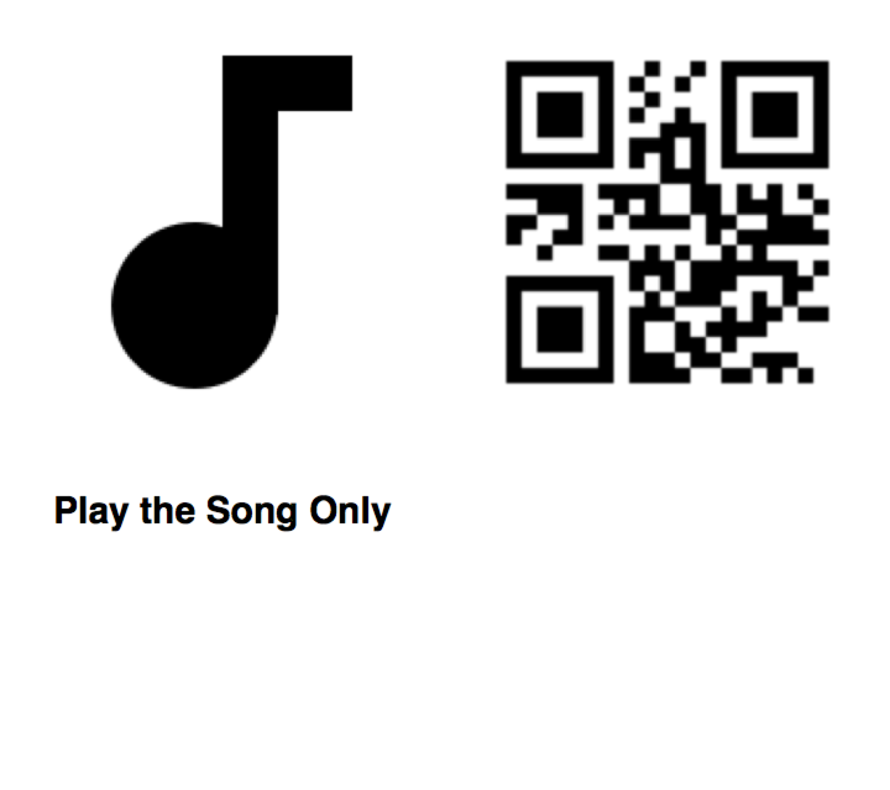 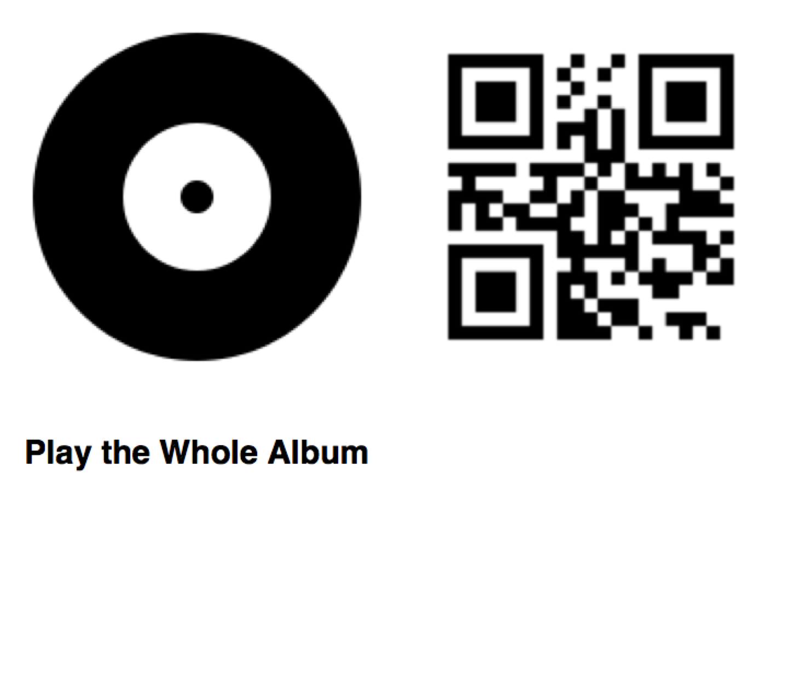
</p>

<p align="center">
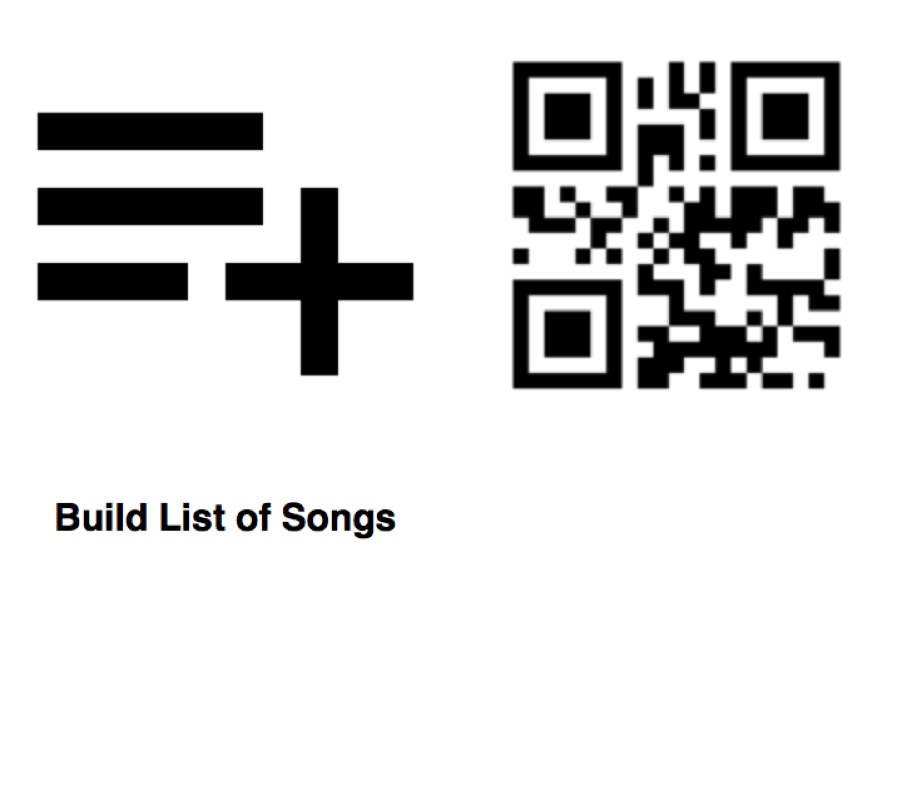 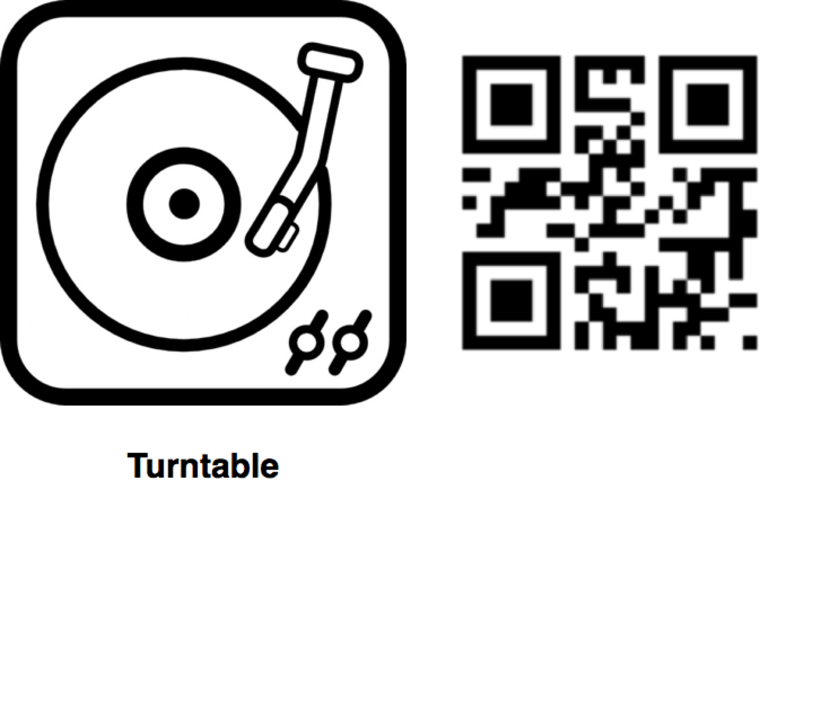
</p>

<p align="center">
 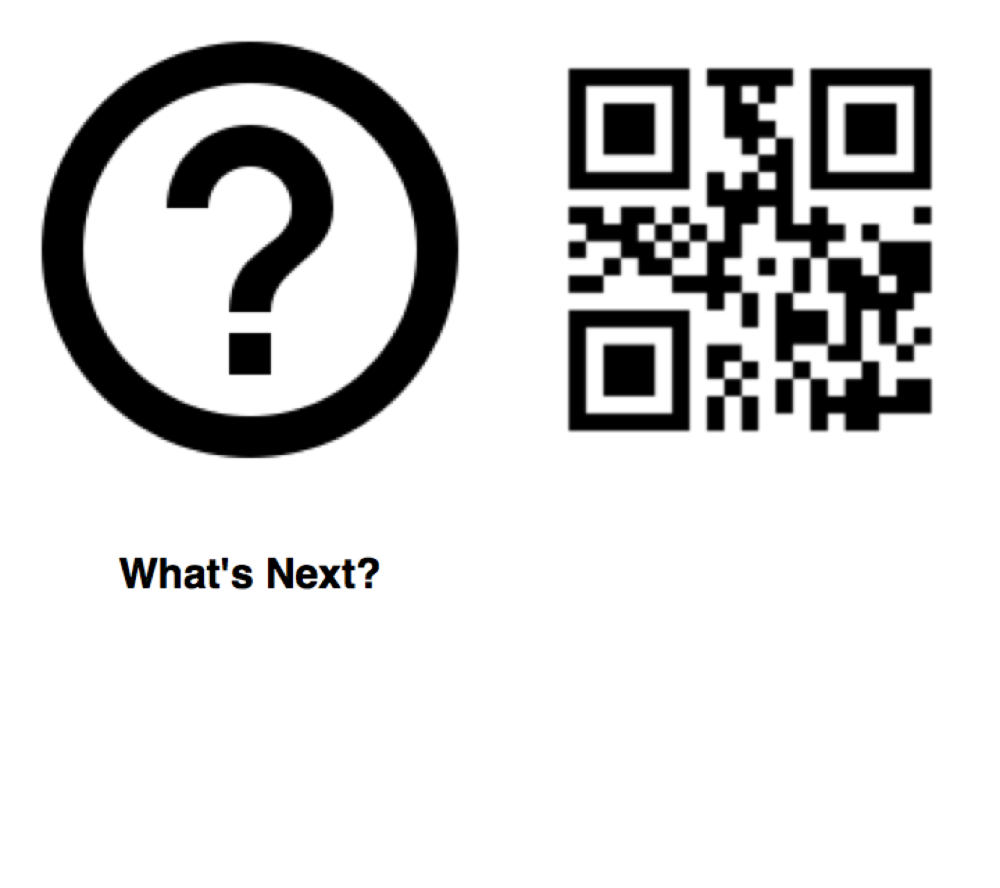
</p>


## Acknowledgments

This project was a great inspiration to develop something that my kids can use. It was a relatively easy project because the groundwork was already laid down by chriscampbell and a series of other people.

Many thanks to the authors' following libraries and tools:

* [qrocodile](https://github.com/chrispcampbell/qrocodile)
* [node-sonos-http-api](https://github.com/jishi/node-sonos-http-api)
* [spotipy](https://github.com/plamere/spotipy)

## License

`qrocodile` is released under an MIT license. See the LICENSE file for the full license.
